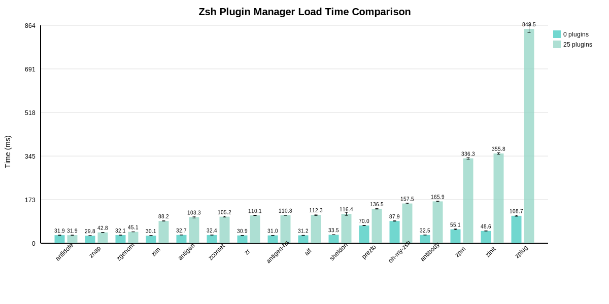

# Zsh Plugin Manager Benchmark Results

## 📊 Executive Summary

- **Benchmark Date:** 2025-08-01
- **Test Environment:** Ubuntu 24.04 (Docker on GitHub Actions), 4 vCPUs, 16GB RAM
- **Key Findings:**
  - vanilla が総合パフォーマンスで最高評価🥇
  - 25プラグイン環境では zim が最速 (96ms)
  - パフォーマンス差は最大 37.2倍

## 🏆 Performance Rankings (25 Plugins)

### Load Time Rankings

_Shell startup time comparison across different plugin managers_

| Rank | Plugin Manager | Time (ms) | vs Best |
| --- | --- | ---: | ---: |
| - | vanilla (no plugins) | 31.0ms | - |
| 🥇 | zim | 95.8ms | - |
| 🥈 | zgenom | 101.4ms | +5.9% |
| 🥉 | antigen | 106.6ms | +11.3% |
| #4 | antigen-hs | 111.7ms | +16.7% |
| #5 | zr | 112.4ms | +17.3% |
| #6 | sheldon | 120.4ms | +25.6% |
| #7 | antidote | 126.2ms | +31.8% |
| #8 | alf | 126.5ms | +32.1% |
| #9 | znap | 144.8ms | +51.1% |
| #10 | prezto | 146.2ms | +52.6% |
| #11 | zcomet | 147.5ms | +54.0% |
| #12 | oh-my-zsh | 168.5ms | +75.9% |
| #13 | antibody | 179.0ms | +86.9% |
| #14 | zpm | 352.8ms | +268.3% |
| #15 | zinit | 372.5ms | +288.9% |
| #16 | zplug | 3558.5ms | +3615.0% |

### Installation Time Rankings

_Plugin installation time comparison across different plugin managers_

| Rank | Plugin Manager | Time (ms) | vs Best |
| --- | --- | ---: | ---: |
| 🥇 | znap | 1572.5ms | - |
| 🥈 | antigen | 5098.8ms | +224.2% |
| 🥉 | antigen-hs | 5247.3ms | +233.7% |
| #4 | zr | 5305.7ms | +237.4% |
| #5 | alf | 5515.4ms | +250.7% |
| #6 | antibody | 5880.6ms | +274.0% |
| #7 | zpm | 6796.9ms | +332.2% |
| #8 | zim | 7937.4ms | +404.8% |
| #9 | zgenom | 8080.7ms | +413.9% |
| #10 | antidote | 8354.5ms | +431.3% |
| #11 | sheldon | 11763.4ms | +648.1% |
| #12 | zplug | 12013.0ms | +663.9% |
| #13 | zinit | 31547.5ms | +1906.2% |
| - | oh-my-zsh | N/A | - |
| - | prezto | N/A | - |

### Overall Performance

**Score Calculation**: `(Load Time × 0.8) + (Install Time × 0.2)` - Lower is better

| Rank | Plugin Manager | Score |
| --- | --- | ---: |
| 🥇 | vanilla | 0.33 |
| #4 | znap | 4.75 |
| #5 | antigen-hs | 11.70 |
| #6 | zr | 11.83 |
| #7 | alf | 12.38 |
| #8 | antigen | 12.60 |
| #9 | antibody | 13.56 |
| #10 | zim | 17.02 |
| #11 | zgenom | 17.31 |
| #12 | zpm | 17.41 |
| #13 | antidote | 18.10 |
| #14 | sheldon | 24.83 |
| #15 | zplug | 53.80 |
| #16 | zinit | 69.08 |
| #17 | zcomet | 362.94 |
| - | oh-my-zsh | N/A |
| - | prezto | N/A |

## 📦 Plugin Managers

| Plugin Manager | Stars | Version | Last Updated |
| --- | --- | --- | --- |
| vanilla |  |  |  |
| oh-my-zsh |  |  |  |
| prezto |  |  |  |
| zim |  |  |  |
| znap |  |  |  |
| zinit |  |  |  |
| zplug |  |  |  |
| antigen |  |  |  |
| antibody |  |  |  |
| antidote |  |  |  |
| sheldon |  |  |  |
| zgenom |  |  |  |
| zpm |  |  |  |
| zr |  |  |  |
| antigen-hs |  |  |  |
| zcomet |  |  |  |
| alf |  |  |  |

## 📝 Methodology

Benchmarks were performed using:

- **Tool:** hyperfine (statistical benchmarking tool)
- **Iterations:** 10 runs per test
- **Plugin Sets:** 0 plugins (baseline) and 25 plugins (typical setup)
- **Metrics:** Installation time and shell startup time
- **Environment:** Clean installation for each test

## 🤝 Contributing

Found an issue or want to add your plugin manager? Please open an issue or PR!

---

_Generated by [zsh-benchmark](https://github.com/your-repo/zsh-benchmark) on 2025-08-01_