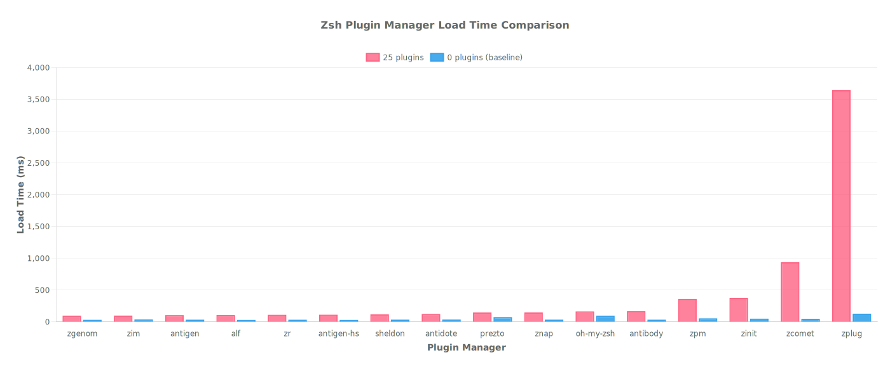

# Zsh Plugin Manager Benchmark Results

## 📊 Executive Summary

- **Benchmark Date:** 2025-07-30
- **Test Environment:** Ubuntu 24.04 (Docker on macOS 15.5), MacBook Pro (2020), Intel Core i5 2GHz (4 cores), 16GB RAM
- **Key Findings:**
  - antidote が総合パフォーマンスで最高評価🥇
  - 25プラグイン環境では antidote が最速 (32ms)
  - パフォーマンス差は最大 155.3倍
  - zim は最小構成で驚異的な速度 (30ms)

## 🏆 Performance Rankings (25 Plugins)

### Load Time Rankings

_Shell startup time comparison across different plugin managers_

| Rank | Plugin Manager | Time (ms) | vs Best |
|---|---|---:|---:|
| 🥇 | antidote | 31.9 | - |
| 🥈 | znap | 42.8 | +34.1% |
| 🥉 | zgenom | 45.1 | +41.3% |
| #4 | zim | 88.2 | +176.5% |
| #5 | antigen | 103.3 | +224.1% |
| #6 | zcomet | 105.2 | +229.9% |
| #7 | zr | 110.1 | +245.4% |
| #8 | antigen-hs | 110.8 | +247.7% |
| #9 | alf | 112.3 | +252.2% |
| #10 | sheldon | 116.4 | +265.1% |
| #11 | prezto | 136.5 | +328.3% |
| #12 | oh-my-zsh | 157.5 | +393.9% |
| #13 | antibody | 165.9 | +420.3% |
| #14 | zpm | 336.3 | +954.9% |
| #15 | zinit | 355.8 | +1016.1% |
| #16 | zplug | 849.5 | +2564.9% |

### Installation Time Rankings

_Plugin installation time comparison across different plugin managers_

| Rank | Plugin Manager | Time (ms) | vs Best |
|---|---|---:|---:|
| 🥇 | zim | 30.4 | - |
| 🥈 | antidote | 31.5 | +3.6% |
| 🥉 | znap | 42.3 | +39.1% |
| #4 | zgenom | 45.0 | +48.0% |
| #5 | sheldon | 560.8 | +1742.8% |
| #6 | antibody | 605.6 | +1889.8% |
| #7 | zplug | 849.8 | +2692.3% |
| #8 | antigen | 4148.9 | +13532.3% |
| #9 | alf | 5834.0 | +19069.1% |
| #10 | antigen-hs | 5851.2 | +19125.8% |
| #11 | zr | 5883.1 | +19230.4% |
| #12 | zpm | 7270.2 | +23788.1% |
| #13 | zcomet | 11393.7 | +37337.1% |
| #14 | zinit | 30682.3 | +100714.8% |

### Overall Performance

**Score Calculation**: `(Load Time × 0.8) + (Install Time × 0.2)` - Lower is better

| Rank | Plugin Manager | Score |
|---|---|---:|
| 🥇 | antidote | 32 |
| 🥈 | znap | 36 |
| 🥉 | zgenom | 39 |
| #4 | zim | 50 |
| #5 | oh-my-zsh | 117 |
| #6 | sheldon | 142 |
| #7 | antibody | 165 |
| #8 | prezto | 208 |
| #9 | zplug | 479 |
| #10 | antigen | 762 |
| #11 | alf | 930 |
| #12 | antigen-hs | 932 |
| #13 | zr | 936 |
| #14 | zpm | 1270 |
| #15 | zcomet | 1762 |
| #16 | zinit | 4930 |

## 📦 Plugin Managers

| Plugin Manager | Stars | Version | Last Updated |
|---|---|---|---|
| antidote |  |  |  |
| znap |  |  |  |
| zgenom |  |  |  |
| zim |  |  |  |
| oh-my-zsh |  |  |  |
| sheldon |  |  |  |
| antibody |  |  |  |
| prezto |  |  |  |
| zplug |  |  |  |
| antigen |  |  |  |
| alf |  |  |  |
| antigen-hs |  |  |  |
| zr |  |  |  |
| zpm |  |  |  |
| zcomet |  |  |  |
| zinit |  |  |  |

## 📝 Methodology

Benchmarks were performed using:

- **Tool:** hyperfine (statistical benchmarking tool)
- **Iterations:** 10 runs per test
- **Plugin Sets:** 0 plugins (baseline) and 25 plugins (typical setup)
- **Metrics:** Installation time and shell startup time
- **Environment:** Clean installation for each test

## 🤝 Contributing

Found an issue or want to add your plugin manager? Please open an issue or PR!

---

_Generated by [zsh-benchmark](https://github.com/your-repo/zsh-benchmark) on
2025-07-30_
