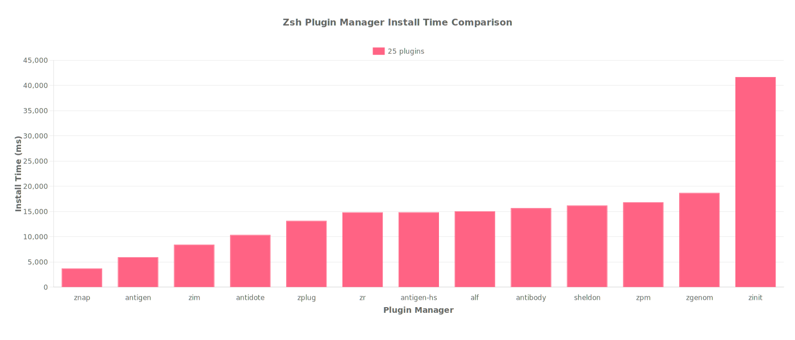

# Zsh Plugin Manager Benchmark Results

## 📊 Executive Summary

- **Benchmark Date:** 2025-07-30
- **Test Environment:** Ubuntu 24.04 (Docker on macOS 15.5), MacBook Pro (2020), Intel Core i5 2GHz (4 cores), 16GB RAM
- **Key Findings:**
  - vanilla が総合パフォーマンスで最高評価🥇
  - 25プラグイン環境では znap が最速 (43ms)
  - パフォーマンス差は最大 112.6倍

## 🏆 Performance Rankings (25 Plugins)

### Load Time Rankings

_Shell startup time comparison across different plugin managers_

| Rank | Plugin Manager | Time (ms) | vs Best |
|---|---|---:|---:|
| 🥇 | znap | 42.8 | - |
| 🥈 | zgenom | 44.4 | +3.9% |
| 🥉 | zim | 92.8 | +116.9% |
| #4 | zcomet | 101.5 | +137.3% |
| #5 | antigen | 102.0 | +138.4% |
| #6 | zr | 108.5 | +153.5% |
| #7 | alf | 109.1 | +155.1% |
| #8 | antigen-hs | 109.5 | +155.8% |
| #9 | sheldon | 112.6 | +163.1% |
| #10 | antidote | 118.0 | +175.7% |
| #11 | prezto | 138.2 | +222.9% |
| #12 | oh-my-zsh | 158.9 | +271.4% |
| #13 | antibody | 166.4 | +288.8% |
| #14 | zpm | 331.4 | +674.5% |
| #15 | zinit | 355.3 | +730.3% |
| #16 | zplug | 863.9 | +1918.9% |

### Installation Time Rankings

_Plugin installation time comparison across different plugin managers_

| Rank | Plugin Manager | Time (ms) | vs Best |
|---|---|---:|---:|
| 🥇 | znap | 43.5 | - |
| 🥈 | zgenom | 44.0 | +1.3% |
| 🥉 | zplug | 855.4 | +1867.3% |
| #4 | antigen | 4102.7 | +9335.4% |
| #5 | alf | 5842.8 | +13337.4% |
| #6 | zr | 5878.5 | +13419.5% |
| #7 | antigen-hs | 5947.2 | +13577.5% |
| #8 | antibody | 6458.7 | +14754.0% |
| #9 | zpm | 7340.1 | +16781.0% |
| #10 | zim | 7826.6 | +17899.8% |
| #11 | antidote | 8058.5 | +18433.3% |
| #12 | zcomet | 11458.9 | +26253.7% |
| #13 | sheldon | 11554.4 | +26473.3% |
| #14 | zinit | 30987.7 | +71166.7% |

### Overall Performance

**Score Calculation**: `(Load Time × 0.8) + (Install Time × 0.2)` - Lower is better

| Rank | Plugin Manager | Score |
|---|---|---:|
| 🥇 | vanilla | 30 |
| 🥈 | znap | 36 |
| 🥉 | zgenom | 38 |
| #4 | zplug | 489 |
| #5 | antigen | 526 |
| #6 | alf | 643 |
| #7 | zr | 646 |
| #8 | antigen-hs | 653 |
| #9 | antibody | 728 |
| #10 | zim | 837 |
| #11 | antidote | 871 |
| #12 | zpm | 916 |
| #13 | zcomet | 1202 |
| #14 | sheldon | 1217 |
| #15 | zinit | 3384 |

## 📦 Plugin Managers

| Plugin Manager | Stars | Version | Last Updated |
|---|---|---|---|
| vanilla |  |  |  |
| znap |  |  |  |
| zgenom |  |  |  |
| zplug |  |  |  |
| antigen |  |  |  |
| alf |  |  |  |
| zr |  |  |  |
| antigen-hs |  |  |  |
| antibody |  |  |  |
| zim |  |  |  |
| antidote |  |  |  |
| zpm |  |  |  |
| zcomet |  |  |  |
| sheldon |  |  |  |
| zinit |  |  |  |

## 📝 Methodology

Benchmarks were performed using:

- **Tool:** hyperfine (statistical benchmarking tool)
- **Iterations:** 10 runs per test
- **Plugin Sets:** 0 plugins (baseline) and 25 plugins (typical setup)
- **Metrics:** Installation time and shell startup time
- **Environment:** Clean installation for each test

## 🤝 Contributing

Found an issue or want to add your plugin manager? Please open an issue or PR!

---

_Generated by [zsh-benchmark](https://github.com/your-repo/zsh-benchmark) on
2025-07-30_
